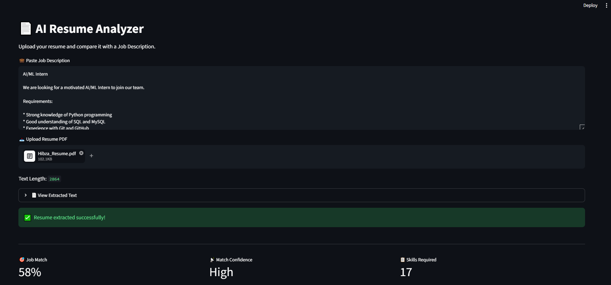
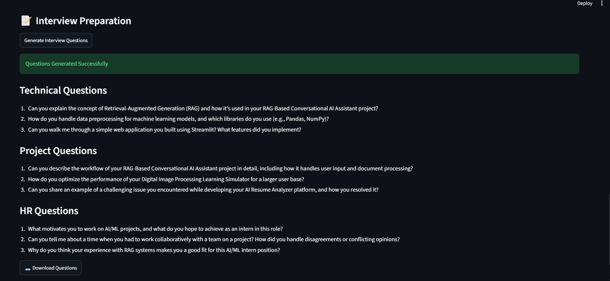

# 🤖 AI Resume Analyzer

An AI-powered Resume Analyzer that evaluates resumes against job descriptions using OCR, LLMs, and a multi-agent workflow. The application dynamically extracts job requirements, analyzes ATS compatibility, identifies skill gaps, generates personalized interview questions, and provides actionable resume improvement suggestions.

Unlike traditional ATS tools that rely on fixed keyword matching, this project uses AI-powered skill extraction, enabling it to work across technical and non-technical roles.

---

## 🚀 Live Demo

**Live App:** https://multi-agent-ai-resume-analyzer.streamlit.app/

**GitHub Repository:** https://github.com/Hibza-Kudari/resume_analyzer_ATS

---

## ✨ Features

### 📄 Resume Parsing

* Extracts text from PDF resumes using **PyMuPDF**
* Automatically falls back to OCR for scanned resumes
* Supports both digital and scanned PDFs

### 🎯 ATS & Job Match Analysis

* Dynamic AI-powered job requirement extraction
* ATS compatibility scoring
* Confidence-aware job matching
* Domain-agnostic analysis for any profession

### 🧠 Skill Gap Analysis

* Detects matched and missing skills
* Works for technical and non-technical roles
* Personalized learning recommendations

### 🤖 AI Resume Review

* Resume strengths and weaknesses
* ATS improvement suggestions
* Missing skills analysis
* AI-generated resume feedback

### 📝 Interview Preparation

* Technical interview questions
* Project-based questions
* HR questions
* Personalized according to resume and job description

### 📊 Dashboard

* Resume score
* Job match percentage
* Skill match visualization
* Downloadable AI feedback
* Downloadable interview questions

---

## 🏗 Architecture

```text
Resume PDF
     │
     ▼
PyMuPDF / OCR
     │
     ▼
Resume Text
     │
     ▼
Supervisor Workflow
     │
 ┌────┼───────────┐
 ▼    ▼           ▼
ATS  Skill Gap  Interview
     Analysis     Questions
 └────┼───────────┘
      ▼
AI Resume Report
```

---

## 🛠 Tech Stack

### Frontend

* Streamlit

### Backend

* Python

### AI & LLM

* Groq API
* Llama 3.3 70B Versatile

### Resume Processing

* PyMuPDF
* OCR
* Dynamic AI Skill Extraction

### Visualization

* Plotly
* Pandas

### Development

* Git
* GitHub

---

## 📷 Screenshots

### Home


### Resume Analysis



### Skills Detection


### AI Feedback


### Interview Questions



---

## ⚙️ Installation

```bash
git clone https://github.com/Hibza-Kudari/resume_analyzer_ATS.git

cd resume_analyzer_ATS/src

pip install -r requirements.txt

streamlit run app.py
```

---

## 🔑 Environment Variables

Create a `.env` file:

```env
GROQ_API_KEY=your_groq_api_key
GROQ_MODEL=llama-3.3-70b-versatile
```

---

## 📁 Project Structure

```text
src/
│
├── agents/
│   ├── ats_agent.py
│   ├── interview_agent.py
│   ├── skill_gap_agent.py
│   └── supervisor_agent.py
│
├── app.py
├── ollama_helper.py
├── ocr_helper.py
├── skill_extractor.py
├── skills.py
├── requirements.txt
└── screenshots/
```

---

## 🚀 Future Improvements

* Resume ranking for recruiters
* Multi-resume comparison
* PDF report export
* Career roadmap generation
* Recruiter dashboard
* RAG-based resume recommendations
* Vector database support

---

## 👩‍💻 Author

**Hibza Kudari**

B.Tech – Artificial Intelligence & Machine Learning

Interested in AI Engineering, LLM Applications, Multi-Agent Systems, RAG, and Generative AI.
